# airfoil_ann
根据[XFOIL计算得到的CLARK-Y翼型性能数据](https://github.com/jiangk-cn/airfoil_performance)，训练得到一个还不错的神经网络模型，可以用于翼型性能预测

## ANN model
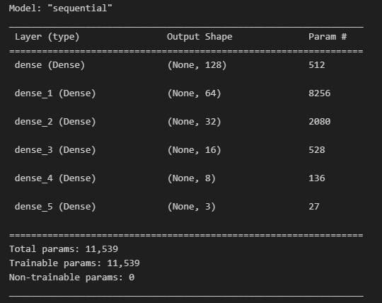

## Benchmark Output
### CNN7
#### CNN7 at Re=1323157
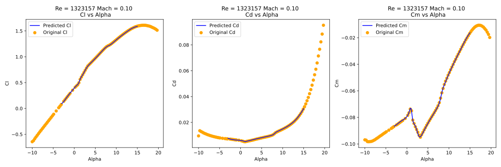

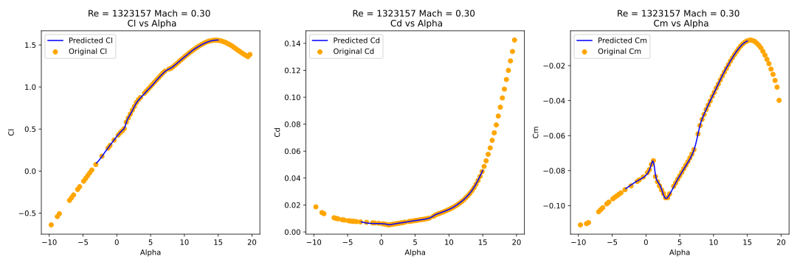
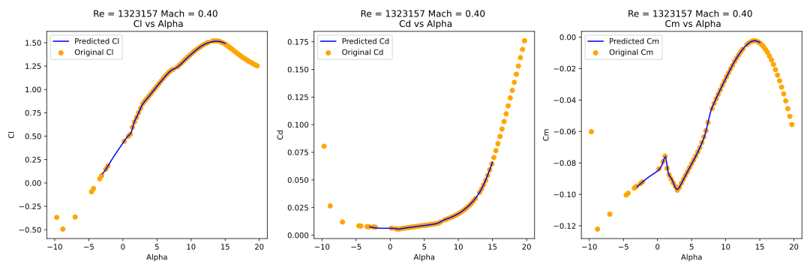

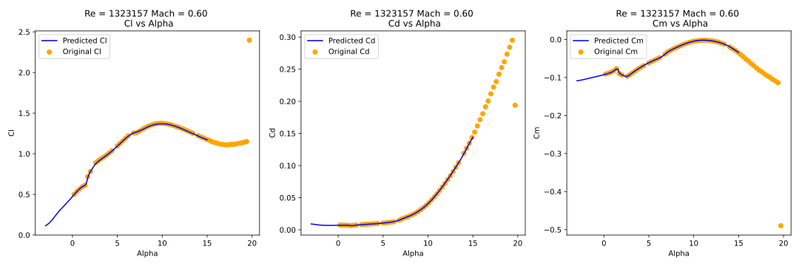
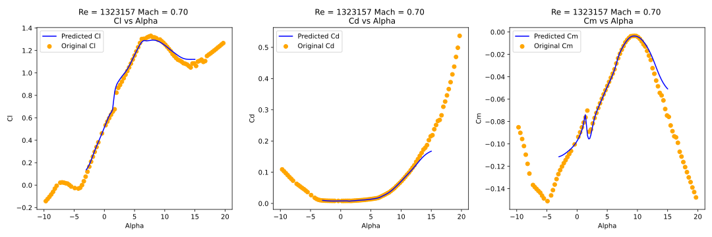
#### CNN7 at Re=3686842

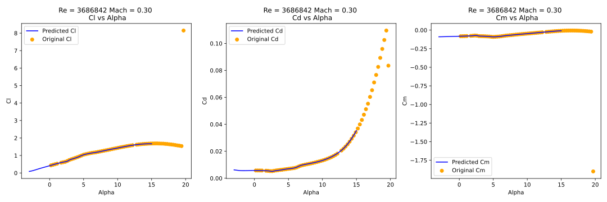
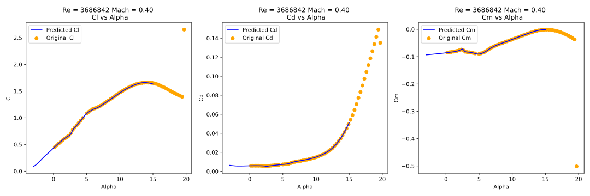

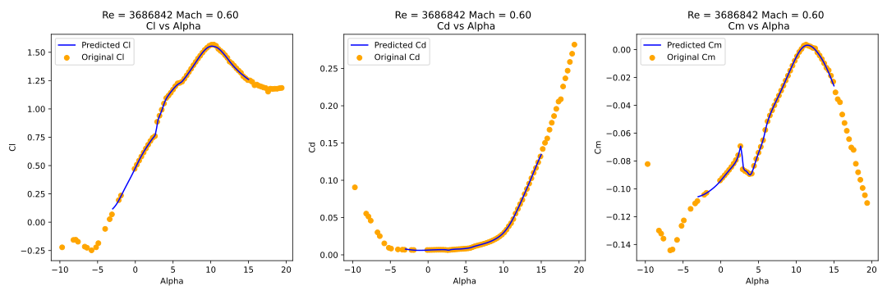
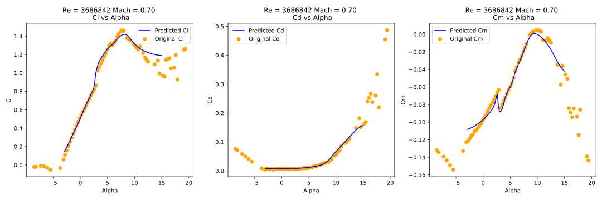

### CNN8
#### CNN8 at Re=1323157

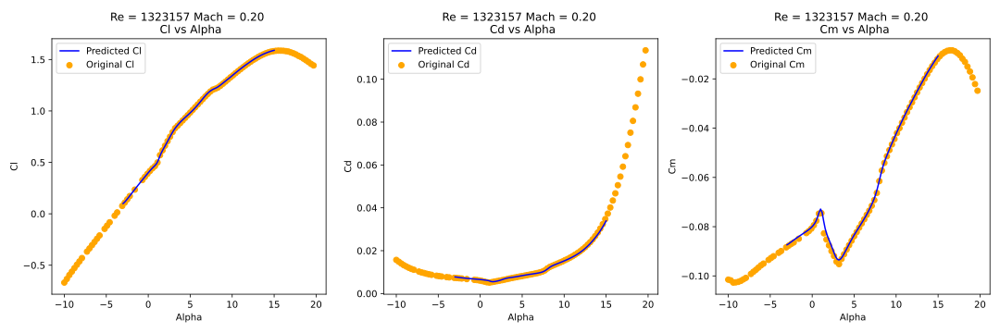
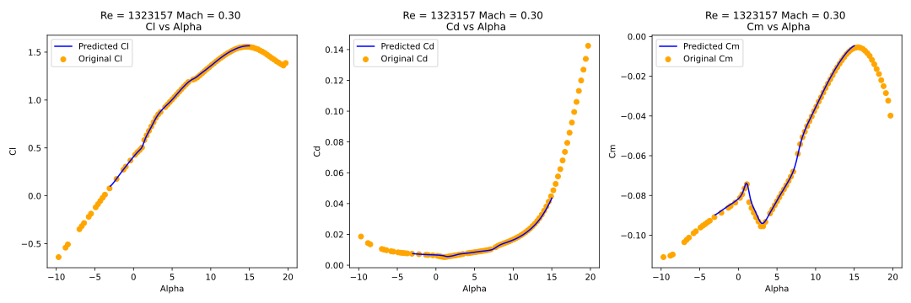

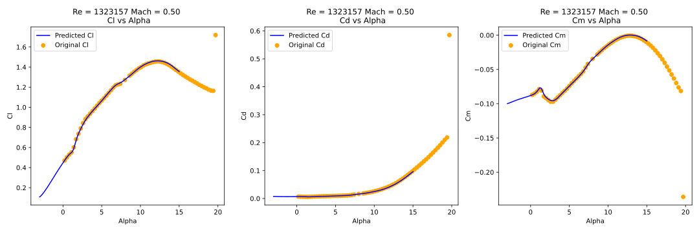

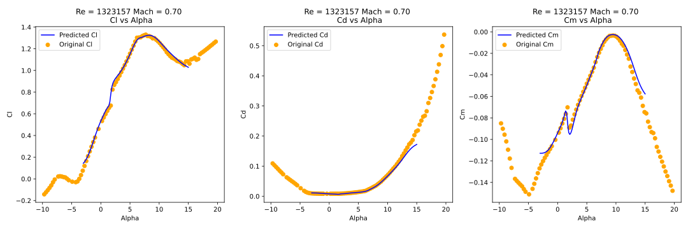
#### CNN8 at Re=3686842
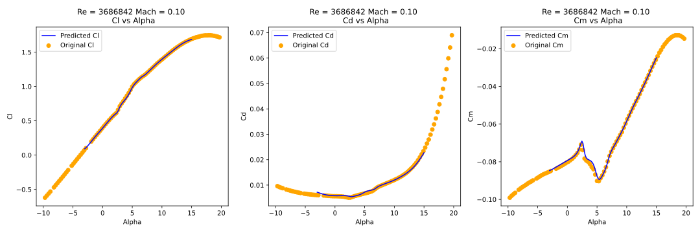
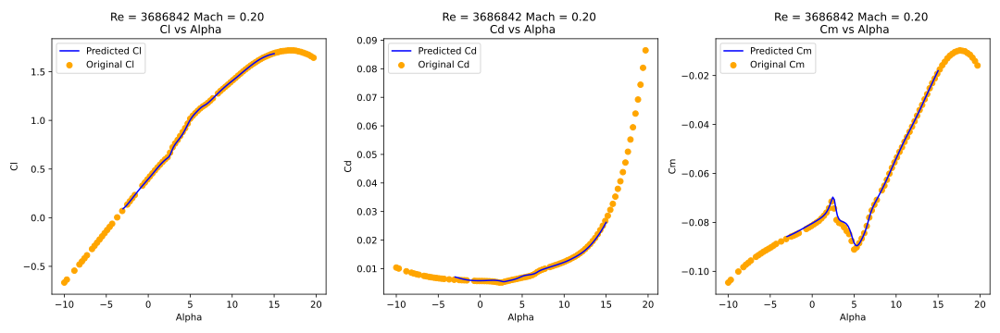
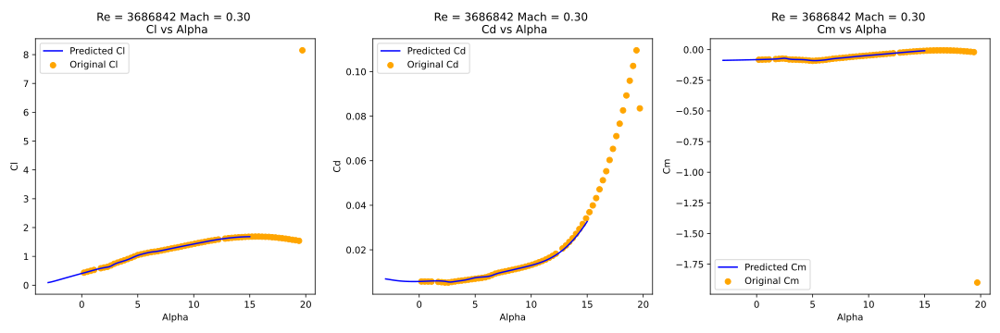
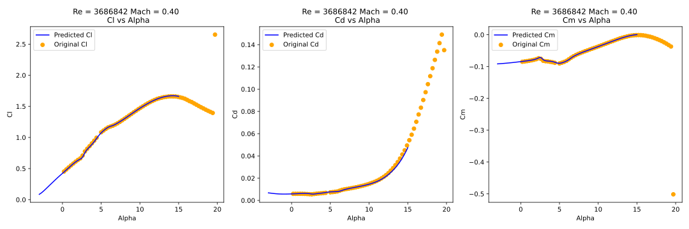
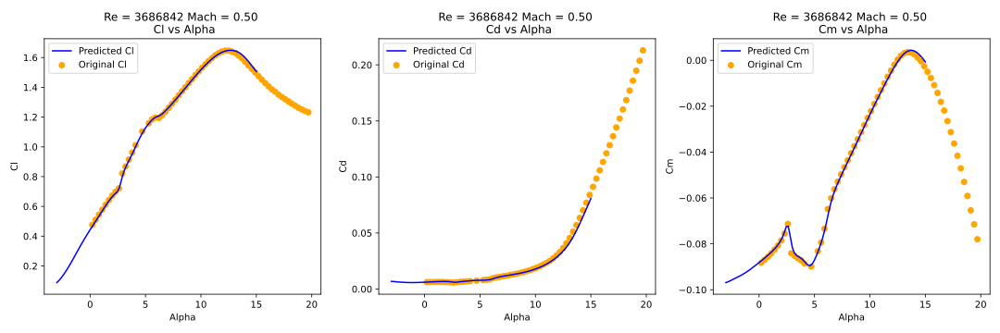

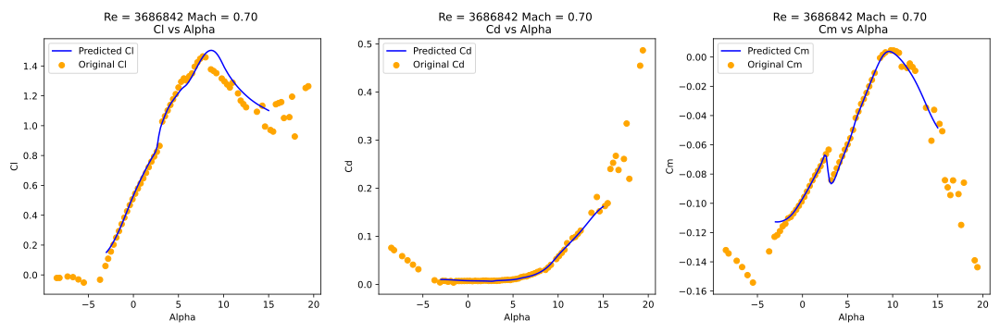

## TODO
高马赫数下模型可能会失真，可能是因为高马赫数下的数据量较少，cnn8看起来会更好一些
