# airfoil_ann
根据[XFOIL计算得到的CLARK-Y翼型性能数据](https://github.com/jiangk-cn/airfoil_performance)，训练得到一个还不错的神经网络模型，可以用于翼型性能预测

## ANN model
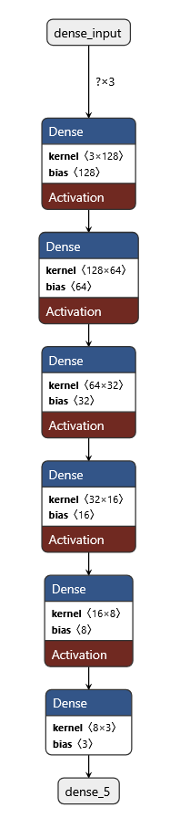

## Benchmark Output
### Reynolds Number = 48542
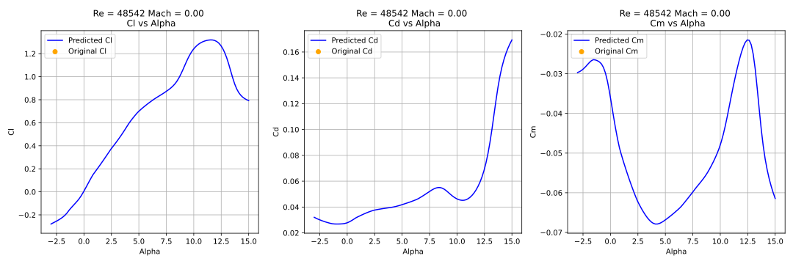
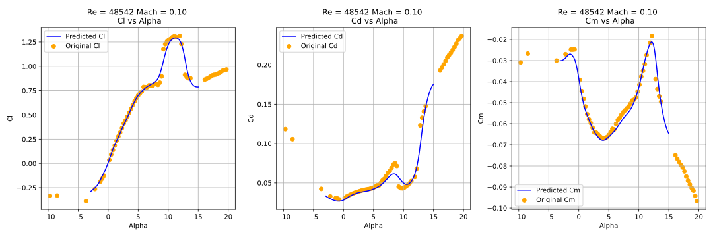
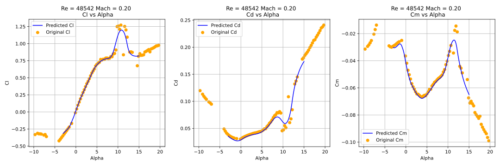
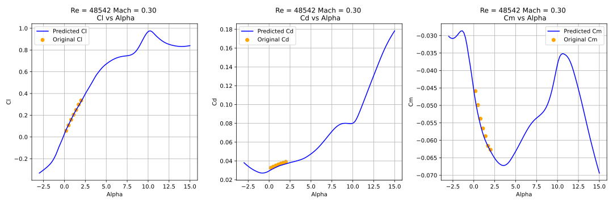
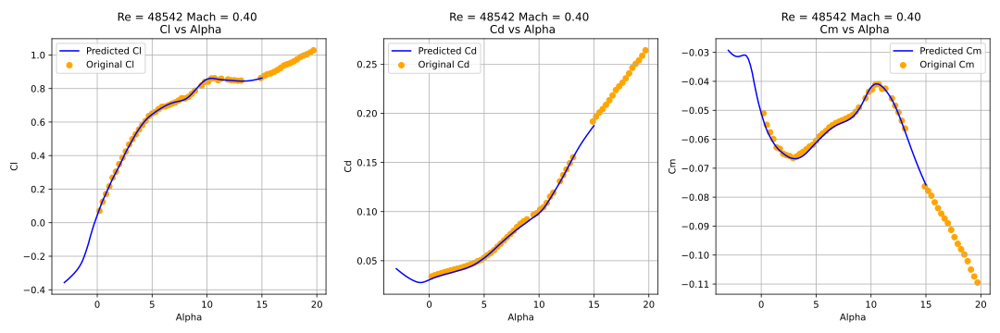
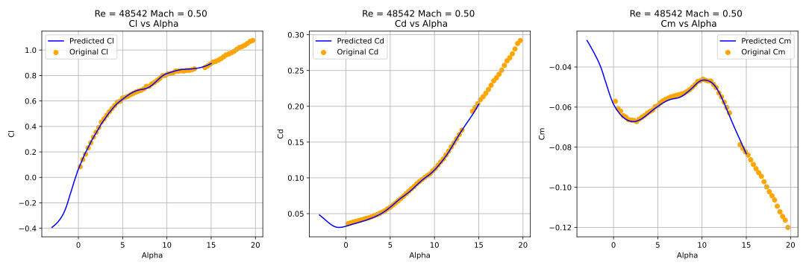
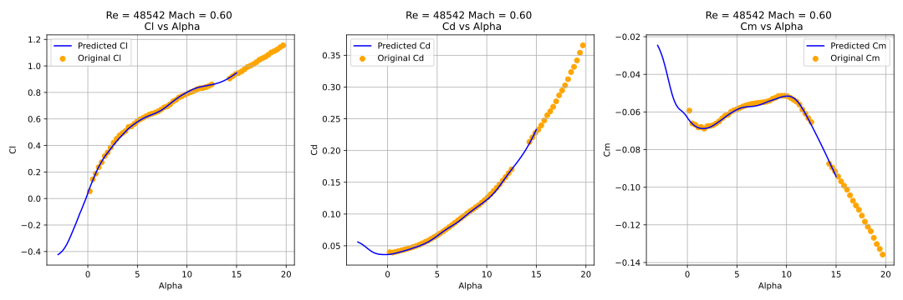
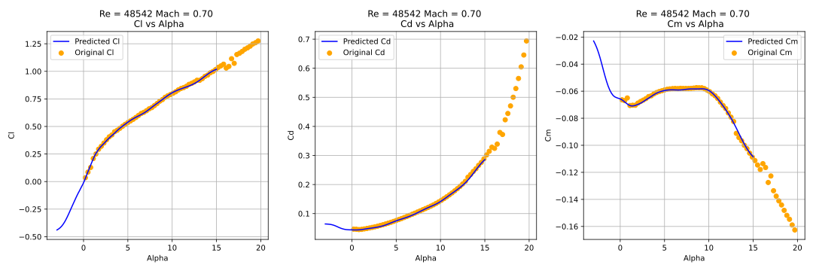

### Reynolds Number = 775862
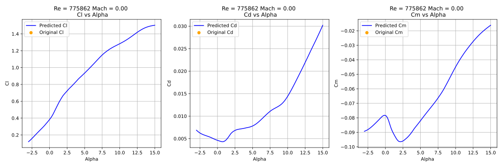
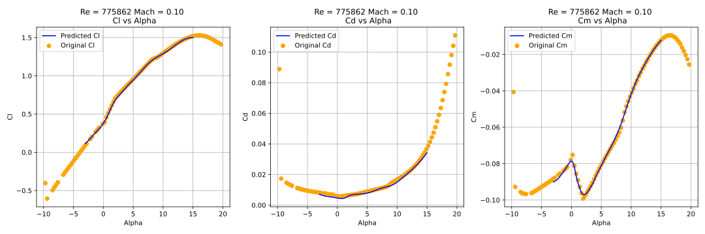
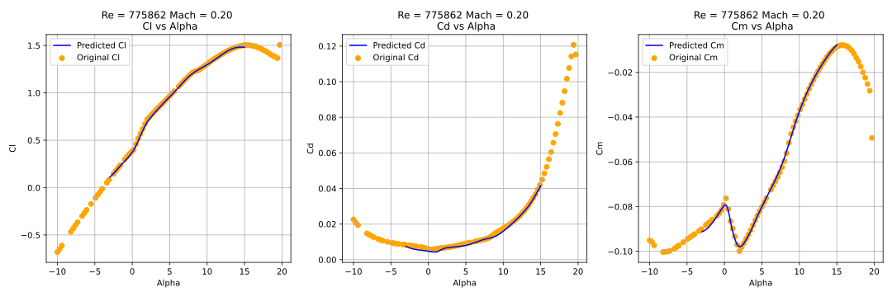
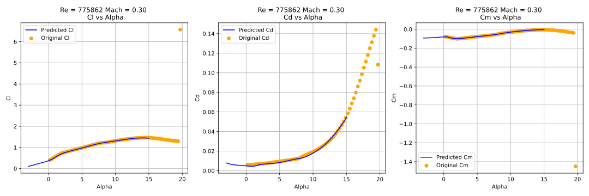
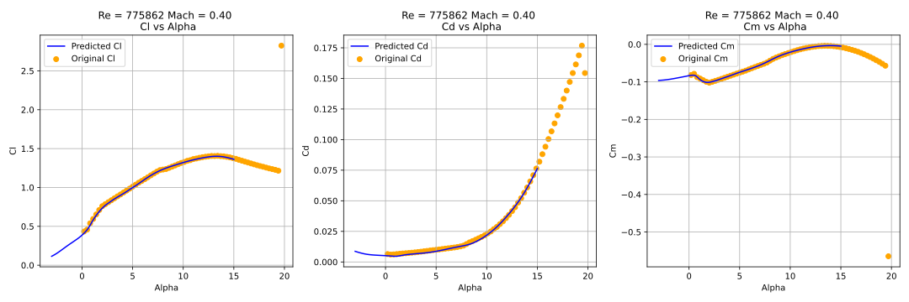
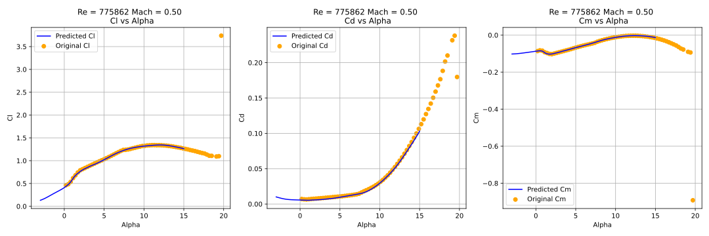
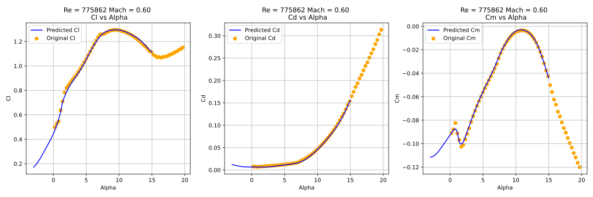
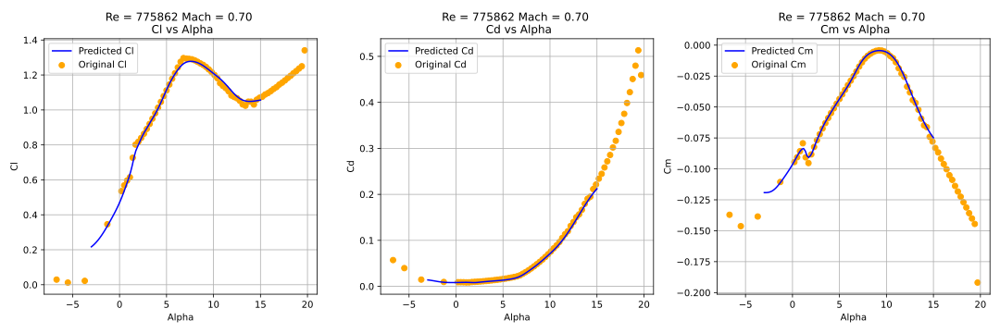

## TODO
根据与数据库中没有的0.0马赫数据库的对比，还存在一些点的预测效果不好，但是目前的模型基本可用，用法可以参考[load_ann_model.ipynb](load_ann_model.ipynb)
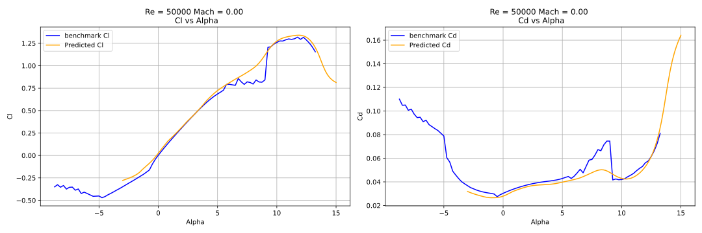